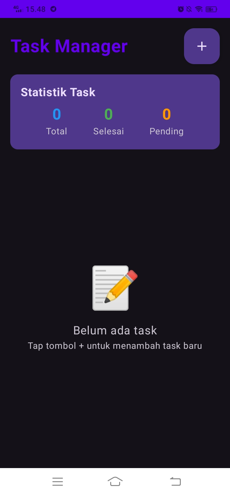
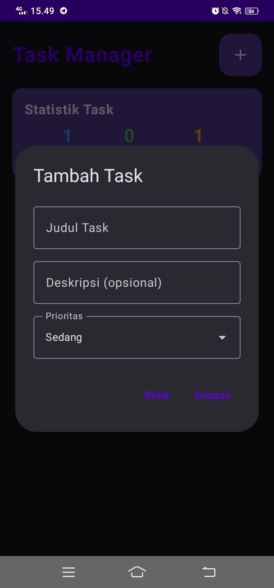
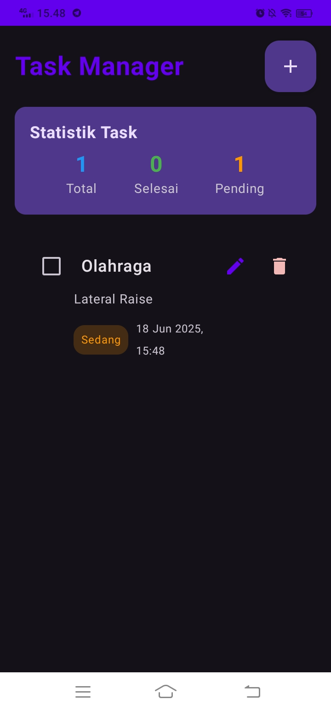
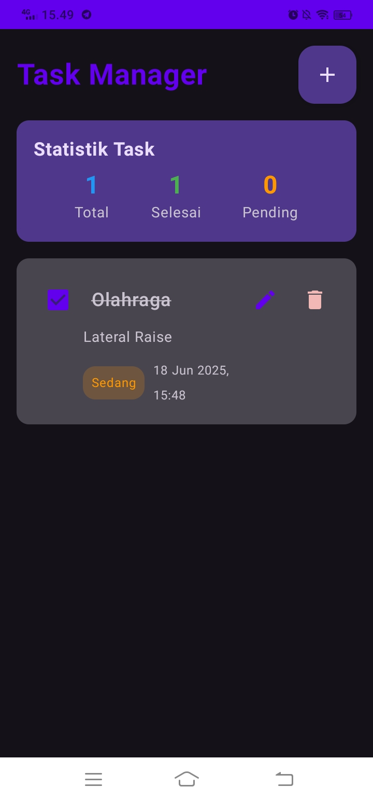

<h1>📋 TaskManager</h1>

<strong>TaskManager</strong> adalah aplikasi Android sederhana yang dibangun menggunakan <strong>Kotlin</strong> dan <strong>Android Studio</strong>. Aplikasi ini bertujuan untuk mendemonstrasikan dasar-dasar pengembangan Android native dengan antarmuka pengguna yang sederhana dan efisien.

<h2>✨ Fitur Utama</h2>
<ul>
    <li>Antarmuka pengguna dasar dan mudah digunakan.</li>
    <li>Navigasi antar layar.</li>
    <li>Tampilan visual dari aplikasi tersedia melalui screenshot.</li>
</ul>

<h2>📸 Screenshot</h2>
<table>
<tr>
    <td></td>
    <td></td>
</tr>
<tr>
    <td></td>
    <td></td>
</tr>
</table>

<h2>🛠️ Teknologi yang Digunakan</h2>
<ul>
    <li><strong>Kotlin</strong></li>
    <li><strong>Android Studio</strong></li>
    <li>(Opsional) ViewBinding, RecyclerView, ConstraintLayout</li>
</ul>

<h2>🚀 Cara Menjalankan Proyek</h2>
<ol>
    <li>Clone repositori ini:
    <pre><code>git clone https://github.com/username/taskmanager.git</code></pre></li>
    <li>Buka proyek di <strong>Android Studio</strong>.</li>
    <li>Tunggu hingga proses <strong>Gradle Sync</strong> selesai.</li>
    <li>Jalankan aplikasi di emulator atau perangkat Android.</li>
</ol>

ℹ️ <strong>Catatan:</strong> Kode sumber Kotlin dan file konfigurasi belum ditambahkan dalam repositori ini. Silakan unggah file <code>.kt</code>, <code>.xml</code>, dan <code>build.gradle</code> agar proyek dapat dijalankan sepenuhnya.

